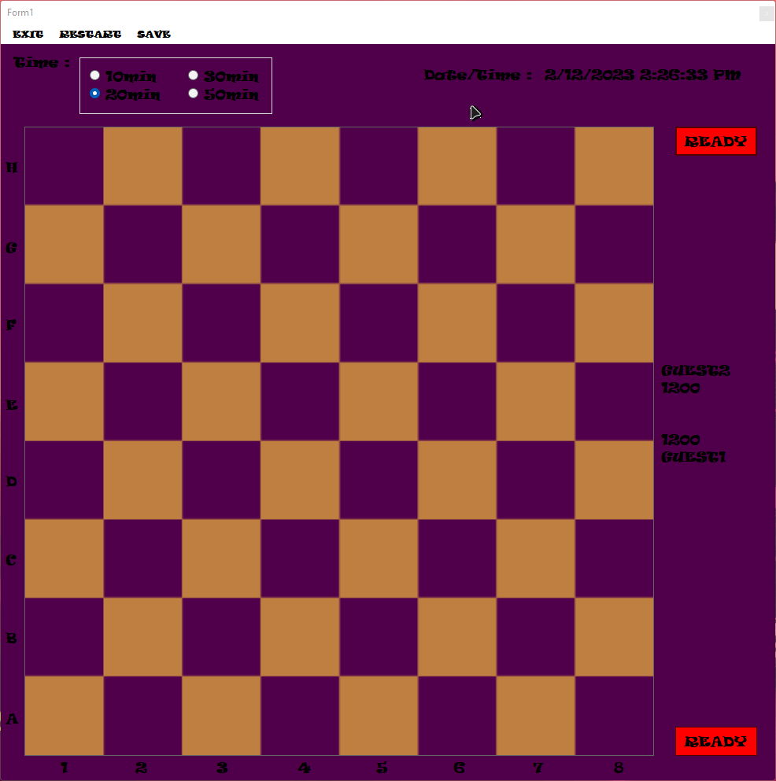
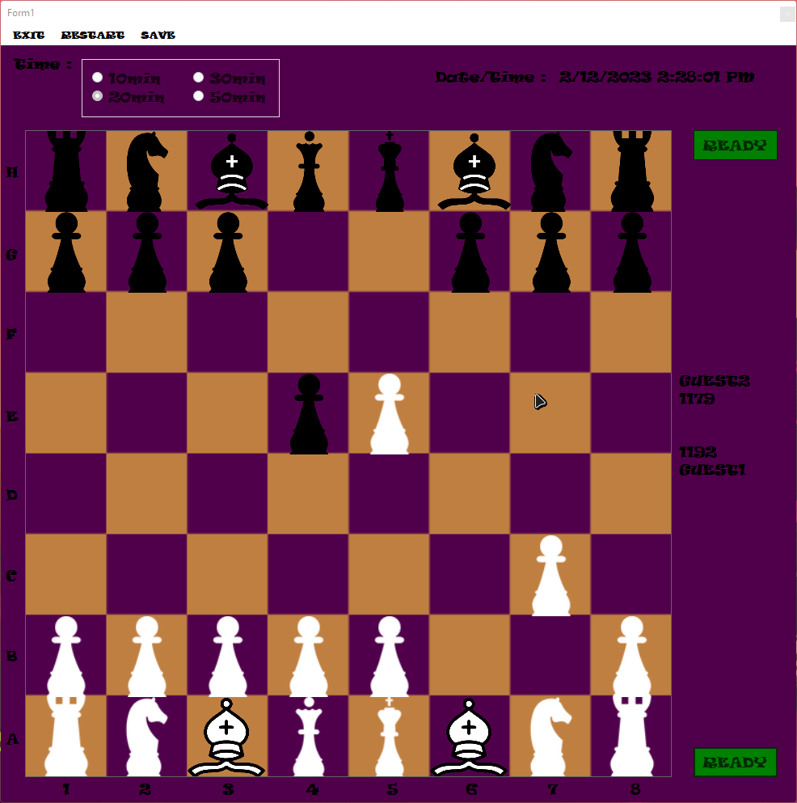

# Chess Board App 

## Personal Project in C# WinForms

**This project is a simple chess board.**  
There is no move prediction, no computer turn  
Two physical players, play in correct order on the same computer.   

## Rules
* White pawn player starts
* Before attack move must double click the pawn to be eliminated.

## Gallery  

